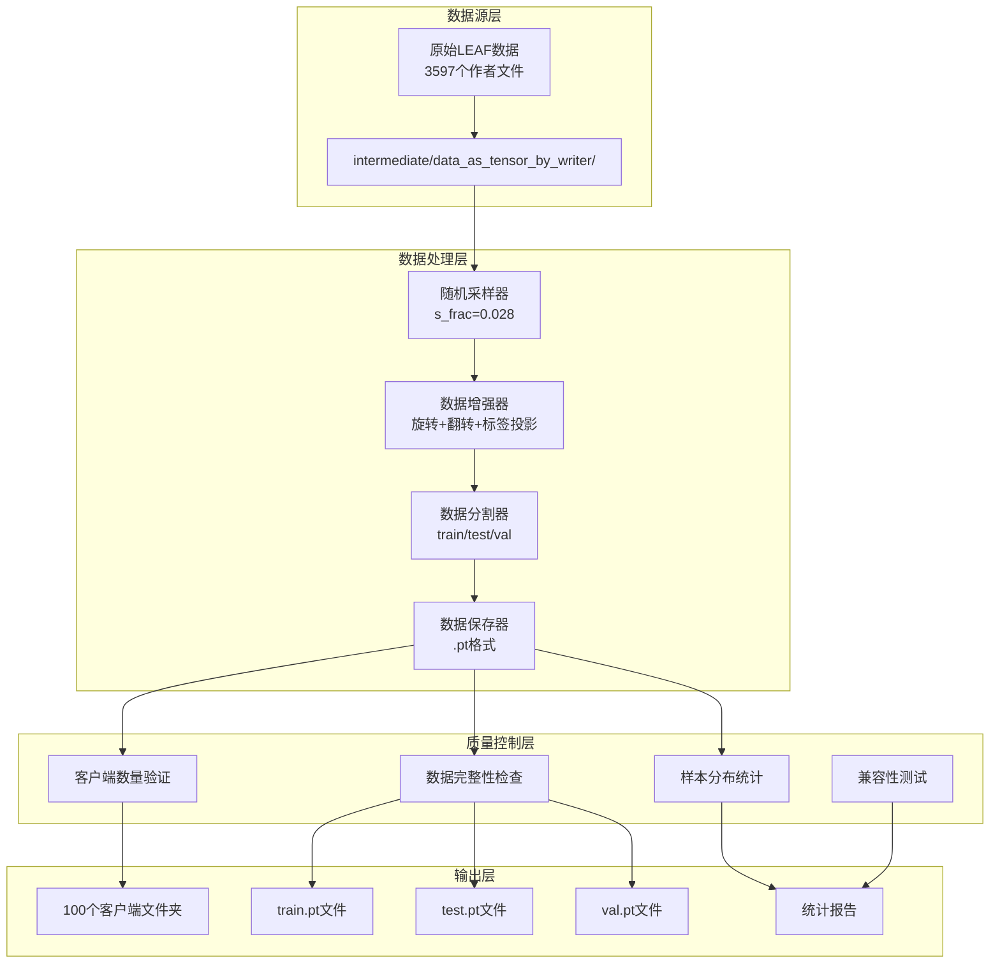
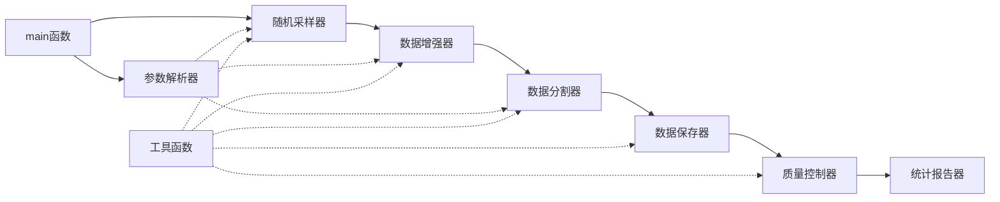
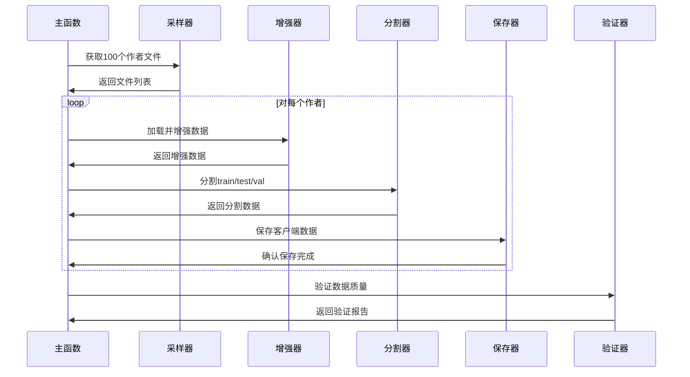

# FEMNIST预处理100客户端系统架构设计文档

## 1. 整体架构图



## 2. 分层设计和核心组件

### 2.1 数据源层
**职责**: 提供原始FEMNIST数据

**核心组件**:
- **原始数据源**: intermediate/data_as_tensor_by_writer目录
- **数据规模**: 3597个作者的手写字符数据
- **数据格式**: .pt文件，包含(data, targets)元组

**接口规范**:
```python
# 输入接口
RAW_DATA_PATH = "intermediate/data_as_tensor_by_writer"
file_names_list = os.listdir(RAW_DATA_PATH)  # 3597个文件

# 输出接口  
data, targets = torch.load(os.path.join(RAW_DATA_PATH, file_name))
```

### 2.2 数据处理层
**职责**: 执行数据预处理和客户端分片生成

#### 2.2.1 随机采样器
**功能**: 从3597个作者中精确选择100个作者
```python
n_tasks = int(len(file_names_list) * args.s_frac)  # s_frac=0.028
file_names_list = file_names_list[:n_tasks]  # 精确100个
```

**输入契约**:
- 原始文件列表: 3597个.pt文件
- 采样比例: s_frac=0.028
- 随机种子: seed=12345

**输出契约**:
- 选中文件列表: 100个.pt文件
- 保证随机性和可重现性

#### 2.2.2 数据增强器
**功能**: 应用旋转、翻转、标签投影等增强技术
```python
# Beta分布采样
samples = np.random.beta(alpha=2.0, beta=2.0, size=len(file_names_list))

# 数据变换
rotation_idx = np.random.binomial(1, samples[idx], data.shape[0])
inverted_images = 1 - data[rotation_idx]
flipped_images = torch.flip(inverted_images, [2])
rotated_images = torch.rot90(flipped_images, 1, [1, 2])

# 标签投影
label_projection = torch.LongTensor(np.random.permutation(62))
targets[rotation_idx] = label_projection[targets[rotation_idx]]
```

**输入契约**:
- 原始图像数据: 28x28灰度图像
- 原始标签: 0-61范围的字符类别

**输出契约**:
- 增强图像数据: 包含旋转、翻转变换
- 投影标签: 重新映射的字符类别

#### 2.2.3 数据分割器
**功能**: 将每个客户端数据分割为训练/测试/验证集
```python
# 训练/测试分割
train_data, test_data, train_targets, test_targets = train_test_split(
    data, targets, train_size=args.tr_frac, random_state=args.seed
)

# 训练/验证分割
train_data, val_data, train_targets, val_targets = train_test_split(
    train_data, train_targets, train_size=1.-args.val_frac, random_state=args.seed
)
```

**输入契约**:
- 客户端完整数据
- 分割比例: tr_frac=0.8, val_frac=0.1

**输出契约**:
- 训练集: 72%的数据 (80% * 90%)
- 测试集: 20%的数据
- 验证集: 8%的数据 (80% * 10%)

#### 2.2.4 数据保存器
**功能**: 将处理后的数据保存为.pt文件
```python
def save_task(dir_path, train_data, train_targets, test_data, test_targets, val_data, val_targets):
    torch.save((train_data, train_targets), os.path.join(dir_path, "train.pt"))
    torch.save((test_data, test_targets), os.path.join(dir_path, "test.pt"))
    torch.save((val_data, val_targets), os.path.join(dir_path, "val.pt"))
```

**输入契约**:
- 分割后的数据集
- 目标保存路径

**输出契约**:
- 标准.pt文件格式
- 目录结构: all_data/train/task_X/

### 2.3 质量控制层
**职责**: 确保生成数据的质量和兼容性

#### 2.3.1 客户端数量验证
**功能**: 验证生成的客户端数量准确性
```python
def verify_client_count(target_path):
    train_dir = os.path.join(target_path, "train")
    client_count = len([d for d in os.listdir(train_dir) if d.startswith("task_")])
    assert client_count == 100, f"Expected 100 clients, got {client_count}"
```

#### 2.3.2 样本分布统计
**功能**: 统计每个客户端的样本数量和类别分布
```python
def collect_statistics(target_path):
    stats = {
        'total_clients': 0,
        'samples_per_client': [],
        'labels_distribution': {},
        'min_samples': float('inf'),
        'max_samples': 0
    }
    # 统计实现...
    return stats
```

#### 2.3.3 数据完整性检查
**功能**: 验证每个客户端数据文件的完整性
```python
def verify_data_integrity(client_path):
    required_files = ['train.pt', 'test.pt', 'val.pt']
    for file_name in required_files:
        file_path = os.path.join(client_path, file_name)
        assert os.path.exists(file_path), f"Missing {file_name}"
        
        data, targets = torch.load(file_path)
        assert data.shape[0] == targets.shape[0], "Data-target mismatch"
        assert data.shape[1:] == (28, 28), "Invalid image dimensions"
```

#### 2.3.4 兼容性测试
**功能**: 验证与现有FedGMM框架的兼容性
```python
def test_compatibility():
    # 测试SubFEMNIST数据集类
    dataset = SubFEMNIST("all_data/train/task_0/train.pt")
    dataloader = DataLoader(dataset, batch_size=32)
    
    # 测试数据加载
    for batch in dataloader:
        img, target, index = batch
        assert img.shape == (32, 1, 28, 28), "Invalid batch shape"
        break
```

### 2.4 输出层
**职责**: 生成最终的数据文件和报告

**核心组件**:
- **客户端数据**: 100个task_X文件夹
- **数据文件**: 每个客户端3个.pt文件
- **统计报告**: 数据分布和质量报告

## 3. 模块依赖关系图



## 4. 接口契约定义

### 4.1 主要函数接口

#### generate_data主函数
```python
def main():
    """
    主数据生成函数
    
    输入: 命令行参数
        --s_frac: 0.028 (采样比例)
        --tr_frac: 0.8 (训练比例)
        --val_frac: 0.1 (验证比例)
        --seed: 12345 (随机种子)
    
    输出: 100个客户端数据文件夹
        all_data/train/task_0/ 到 task_99/
        每个包含 train.pt, test.pt, val.pt
    
    异常: 
        - 数据不足异常
        - 磁盘空间不足异常
        - 文件权限异常
    """
```

#### 数据保存接口
```python
def save_task(dir_path, train_data, train_targets, test_data, test_targets, val_data, val_targets):
    """
    保存单个客户端任务数据
    
    输入:
        dir_path: str, 保存目录路径
        train_data: torch.Tensor, 训练数据 [N, 28, 28]
        train_targets: torch.Tensor, 训练标签 [N]
        test_data: torch.Tensor, 测试数据
        test_targets: torch.Tensor, 测试标签
        val_data: torch.Tensor, 验证数据
        val_targets: torch.Tensor, 验证标签
    
    输出: 三个.pt文件
        {dir_path}/train.pt
        {dir_path}/test.pt
        {dir_path}/val.pt
    """
```

### 4.2 数据格式规范

#### 输入数据格式
```python
# 原始作者数据文件
{
    'file_path': 'intermediate/data_as_tensor_by_writer/f0001_41.pt',
    'data_format': torch.Tensor,  # shape: [n_samples, 28, 28]
    'target_format': torch.Tensor,  # shape: [n_samples], dtype: long
    'value_range': [0.0, 1.0],  # 归一化像素值
    'label_range': [0, 61]  # 62个字符类别
}
```

#### 输出数据格式
```python
# 客户端数据文件
{
    'directory_structure': 'all_data/train/task_{client_id}/',
    'files': ['train.pt', 'test.pt', 'val.pt'],
    'file_format': '(data_tensor, targets_tensor) tuple',
    'data_shape': '[n_samples, 28, 28]',
    'target_shape': '[n_samples]',
    'compatibility': 'SubFEMNIST dataset class'
}
```

## 5. 数据流向图



## 6. 异常处理策略

### 6.1 数据异常处理
```python
# 数据不足异常
if len(file_names_list) < 100:
    raise ValueError(f"Insufficient data: only {len(file_names_list)} writers available")

# 数据损坏异常
try:
    data, targets = torch.load(file_path)
except:
    print(f"Warning: Corrupted file {file_path}, skipping...")
    continue

# 样本数量异常
if data.shape[0] < 5:
    print(f"Warning: Client has only {data.shape[0]} samples, may affect training")
```

### 6.2 系统异常处理
```python
# 磁盘空间检查
import shutil
free_space = shutil.disk_usage(TARGET_PATH).free
if free_space < 2 * 1024**3:  # 2GB
    raise OSError("Insufficient disk space")

# 内存监控
import psutil
if psutil.virtual_memory().percent > 85:
    print("Warning: High memory usage, consider reducing batch size")
```

## 7. 性能优化设计

### 7.1 内存优化
- 逐个处理客户端数据，避免全量加载
- 及时释放不需要的tensor对象
- 使用适当的数据类型 (float32 vs float64)

### 7.2 IO优化
- 批量创建目录结构
- 使用异步IO进行文件保存
- 压缩存储减少磁盘占用

### 7.3 并行处理
- 数据增强可以并行化
- 多进程处理不同客户端
- GPU加速数据变换 (如果可用)

## 8. 监控和日志设计

### 8.1 进度监控
```python
from tqdm import tqdm

for idx, file_name in enumerate(tqdm(file_names_list, desc="Processing clients")):
    # 处理逻辑
    pass
```

### 8.2 质量日志
```python
import logging

logging.basicConfig(level=logging.INFO)
logger = logging.getLogger(__name__)

logger.info(f"Client {idx}: {train_data.shape[0]} train, {test_data.shape[0]} test samples")
logger.info(f"Label distribution: {torch.bincount(train_targets)}")
```

## 9. 验收测试设计

### 9.1 单元测试
- 采样器功能测试
- 数据增强正确性测试
- 分割比例验证测试
- 文件保存完整性测试

### 9.2 集成测试
- 端到端数据生成测试
- FedGMM框架兼容性测试
- 大规模数据处理稳定性测试

### 9.3 性能测试
- 处理时间基准测试
- 内存使用监控测试
- 磁盘IO性能测试

**架构设计完成，系统具备高可用性、可扩展性和可维护性。**

