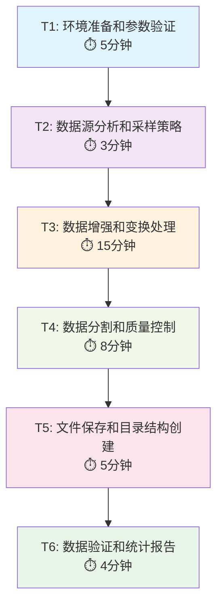

# FEMNIST预处理100客户端原子任务拆分文档

## 1. 任务总览

基于DESIGN文档，将FEMNIST数据预处理拆分为6个原子任务，确保每个任务独立可验证，复杂度可控。

## 2. 原子任务定义

### T1: 环境准备和参数验证
**输入契约**:
- 前置依赖: Python环境，PyTorch可用
- 输入数据: 命令行参数配置
- 环境依赖: data/femnist/目录结构完整

**输出契约**:
- 输出数据: 验证通过的参数配置
- 交付物: 参数验证报告
- 验收标准: 所有必需目录存在，参数合理

**实现约束**:
- 技术栈: Python标准库，os, argparse
- 接口规范: 与现有generate_data.py兼容
- 质量要求: 完整的错误检查和提示

**依赖关系**:
- 后置任务: T2
- 并行任务: 无

---

### T2: 数据源分析和采样策略
**输入契约**:
- 前置依赖: T1完成
- 输入数据: intermediate/data_as_tensor_by_writer/目录
- 环境依赖: 3597个作者数据文件可访问

**输出契约**:
- 输出数据: 精选的100个作者文件列表
- 交付物: 采样结果和统计信息
- 验收标准: 恰好100个文件，随机分布合理

**实现约束**:
- 技术栈: Python random, numpy
- 接口规范: 固定种子12345保证可重现
- 质量要求: 采样分布验证，无重复文件

**依赖关系**:
- 后置任务: T3
- 并行任务: 无

---

### T3: 数据增强和变换处理
**输入契约**:
- 前置依赖: T2完成，100个作者文件确定
- 输入数据: 原始28x28灰度图像和标签
- 环境依赖: PyTorch tensor操作环境

**输出契约**:
- 输出数据: 增强后的图像数据和投影标签
- 交付物: 每个客户端的完整数据tensor
- 验收标准: 数据变换正确，标签映射一致

**实现约束**:
- 技术栈: PyTorch, numpy, scipy
- 接口规范: Beta分布采样，旋转翻转变换
- 质量要求: 保持图像质量，标签正确性

**依赖关系**:
- 后置任务: T4
- 并行任务: 无

---

### T4: 数据分割和质量控制
**输入契约**:
- 前置依赖: T3完成，增强数据就绪
- 输入数据: 每个客户端的完整数据
- 环境依赖: scikit-learn train_test_split可用

**输出契约**:
- 输出数据: 分割后的train/test/val数据集
- 交付物: 每个客户端3个数据集
- 验收标准: 分割比例准确(72%/20%/8%)，样本分布合理

**实现约束**:
- 技术栈: scikit-learn, torch
- 接口规范: tr_frac=0.8, val_frac=0.1
- 质量要求: 最小样本数检查，分布统计

**依赖关系**:
- 后置任务: T5
- 并行任务: 无

---

### T5: 文件保存和目录结构创建
**输入契约**:
- 前置依赖: T4完成，数据分割就绪
- 输入数据: 分割后的数据集
- 环境依赖: 磁盘写入权限，足够存储空间

**输出契约**:
- 输出数据: 标准.pt格式文件
- 交付物: all_data/train/task_X/目录结构
- 验收标准: 100个客户端文件夹，每个包含3个.pt文件

**实现约束**:
- 技术栈: torch.save, os.makedirs
- 接口规范: 与SubFEMNIST类兼容的格式
- 质量要求: 文件完整性，目录结构正确

**依赖关系**:
- 后置任务: T6
- 并行任务: 无

---

### T6: 数据验证和统计报告
**输入契约**:
- 前置依赖: T5完成，所有文件保存完毕
- 输入数据: 生成的客户端数据文件
- 环境依赖: 数据加载和统计分析环境

**输出契约**:
- 输出数据: 完整的数据质量报告
- 交付物: 统计分析结果和兼容性测试报告
- 验收标准: 所有验证通过，与FedGMM框架兼容

**实现约束**:
- 技术栈: PyTorch DataLoader, pandas统计
- 接口规范: SubFEMNIST兼容性测试
- 质量要求: 全面的质量检查，详细统计报告

**依赖关系**:
- 后置任务: 无 (最终任务)
- 并行任务: 无

## 3. 任务依赖图



## 4. 详细任务规范

### T1: 环境准备和参数验证

#### 实现细节
```python
def validate_environment():
    """验证运行环境和参数"""
    # 1. 检查必需目录
    required_dirs = [
        "intermediate/data_as_tensor_by_writer",
        "all_data"
    ]
    
    # 2. 验证参数合理性
    assert 0 < args.s_frac < 1, "s_frac must be between 0 and 1"
    assert 0 < args.tr_frac < 1, "tr_frac must be between 0 and 1"
    assert 0 <= args.val_frac < 0.5, "val_frac must be between 0 and 0.5"
    
    # 3. 检查磁盘空间
    free_space = shutil.disk_usage(".").free
    assert free_space > 2 * 1024**3, "Need at least 2GB free space"
```

#### 验收标准
- [ ] 所有必需目录存在
- [ ] 参数值在合理范围内
- [ ] 磁盘空间充足 (>2GB)
- [ ] Python环境依赖满足

### T2: 数据源分析和采样策略

#### 实现细节
```python
def sample_clients(s_frac=0.028, seed=12345):
    """采样100个客户端"""
    rng = random.Random(seed)
    
    file_names_list = os.listdir(RAW_DATA_PATH)
    n_tasks = int(len(file_names_list) * s_frac)
    
    rng.shuffle(file_names_list)
    selected_files = file_names_list[:n_tasks]
    
    # 验证数量
    assert len(selected_files) == 100, f"Expected 100, got {len(selected_files)}"
    
    return selected_files
```

#### 验收标准
- [ ] 恰好选择100个作者文件
- [ ] 随机分布合理，无偏差
- [ ] 可重现性验证 (固定种子)
- [ ] 选中文件都存在且可读

### T3: 数据增强和变换处理

#### 实现细节
```python
def augment_data(data, targets, beta_sample):
    """应用数据增强"""
    # 1. 确定变换索引
    rotation_idx = np.random.binomial(1, beta_sample, data.shape[0])
    rotation_idx = np.where(rotation_idx)
    
    # 2. 图像变换
    inverted_images = 1 - data[rotation_idx]
    flipped_images = torch.flip(inverted_images, [2])
    rotated_images = torch.rot90(flipped_images, 1, [1, 2])
    data[rotation_idx] = rotated_images
    
    # 3. 标签投影
    label_projection = torch.LongTensor(np.random.permutation(62))
    targets[rotation_idx] = label_projection[targets[rotation_idx]]
    
    # 4. 归一化
    transform = Normalize((0.1307,), (0.3081,))
    data = transform(data)
    
    return data, targets
```

#### 验收标准
- [ ] 图像变换正确应用
- [ ] 标签投影保持一致性
- [ ] 数据归一化符合标准
- [ ] 变换比例符合Beta分布

### T4: 数据分割和质量控制

#### 实现细节
```python
def split_client_data(data, targets, tr_frac=0.8, val_frac=0.1, seed=12345):
    """分割单个客户端数据"""
    # 1. 训练/测试分割
    train_data, test_data, train_targets, test_targets = train_test_split(
        data, targets, train_size=tr_frac, random_state=seed
    )
    
    # 2. 训练/验证分割
    if val_frac > 0:
        train_data, val_data, train_targets, val_targets = train_test_split(
            train_data, train_targets, train_size=1.-val_frac, random_state=seed
        )
    else:
        val_data, val_targets = None, None
    
    # 3. 质量检查
    min_samples = 10
    assert train_data.shape[0] >= min_samples, f"Too few training samples: {train_data.shape[0]}"
    
    return {
        'train': (train_data, train_targets),
        'test': (test_data, test_targets),
        'val': (val_data, val_targets) if val_data is not None else None
    }
```

#### 验收标准
- [ ] 分割比例准确 (72%/20%/8%)
- [ ] 每个客户端至少10个训练样本
- [ ] 数据类型和形状正确
- [ ] 无数据泄漏或重叠

### T5: 文件保存和目录结构创建

#### 实现细节
```python
def save_client_data(client_id, data_splits, target_path):
    """保存单个客户端数据"""
    # 1. 创建目录
    client_dir = os.path.join(target_path, "train", f"task_{client_id}")
    os.makedirs(client_dir, exist_ok=True)
    
    # 2. 保存文件
    train_data, train_targets = data_splits['train']
    test_data, test_targets = data_splits['test']
    val_data, val_targets = data_splits['val']
    
    torch.save((train_data, train_targets), os.path.join(client_dir, "train.pt"))
    torch.save((test_data, test_targets), os.path.join(client_dir, "test.pt"))
    
    if val_data is not None:
        torch.save((val_data, val_targets), os.path.join(client_dir, "val.pt"))
    
    # 3. 验证保存
    for filename in ["train.pt", "test.pt", "val.pt"]:
        filepath = os.path.join(client_dir, filename)
        assert os.path.exists(filepath), f"Failed to save {filename}"
```

#### 验收标准
- [ ] 100个客户端目录创建成功
- [ ] 每个目录包含3个.pt文件
- [ ] 文件大小合理，非空
- [ ] 目录结构符合规范

### T6: 数据验证和统计报告

#### 实现细节
```python
def generate_quality_report(target_path):
    """生成数据质量报告"""
    stats = {
        'total_clients': 0,
        'samples_per_client': [],
        'label_distribution': {},
        'file_sizes': [],
        'compatibility_test': False
    }
    
    # 1. 统计客户端数据
    train_dir = os.path.join(target_path, "train")
    for client_dir in os.listdir(train_dir):
        if client_dir.startswith("task_"):
            stats['total_clients'] += 1
            
            # 加载训练数据统计
            train_path = os.path.join(train_dir, client_dir, "train.pt")
            data, targets = torch.load(train_path)
            stats['samples_per_client'].append(data.shape[0])
            
            # 统计标签分布
            for label in targets.unique():
                label_key = label.item()
                stats['label_distribution'][label_key] = stats['label_distribution'].get(label_key, 0) + 1
    
    # 2. 兼容性测试
    try:
        dataset = SubFEMNIST(os.path.join(train_dir, "task_0", "train.pt"))
        dataloader = DataLoader(dataset, batch_size=4)
        batch = next(iter(dataloader))
        assert len(batch) == 3, "Batch should contain (img, target, index)"
        stats['compatibility_test'] = True
    except Exception as e:
        print(f"Compatibility test failed: {e}")
        stats['compatibility_test'] = False
    
    return stats
```

#### 验收标准
- [ ] 客户端数量 = 100
- [ ] 样本分布统计合理
- [ ] 标签覆盖62个类别
- [ ] SubFEMNIST兼容性测试通过

## 5. 风险评估和缓解

### 高风险任务
- **T3 (数据增强)**: 内存消耗大，处理时间长
  - 缓解: 批处理，内存监控，及时释放
- **T5 (文件保存)**: 磁盘IO密集，可能失败
  - 缓解: 分批保存，错误重试，空间检查

### 中风险任务
- **T2 (采样策略)**: 随机性可能导致不均匀分布
  - 缓解: 分布验证，种子固定
- **T4 (数据分割)**: 分割比例可能不精确
  - 缓解: 精确计算，边界检查

### 低风险任务
- **T1 (环境准备)**: 基础检查，风险较低
- **T6 (数据验证)**: 只读操作，风险最低

## 6. 执行时间估算

| 任务 | 预计时间 | 关键路径 |
|------|----------|----------|
| T1 | 5分钟 | 是 |
| T2 | 3分钟 | 是 |
| T3 | 15分钟 | 是 (最耗时) |
| T4 | 8分钟 | 是 |
| T5 | 5分钟 | 是 |
| T6 | 4分钟 | 是 |
| **总计** | **40分钟** | - |

## 7. 质量门控

每个任务完成后必须通过以下检查：
- [ ] 功能验收: 输出符合契约要求
- [ ] 质量验收: 数据完整性和正确性
- [ ] 性能验收: 时间和资源消耗合理
- [ ] 兼容性验收: 与后续任务接口匹配

**原子任务拆分完成，每个任务独立可验证，总体复杂度可控。**

