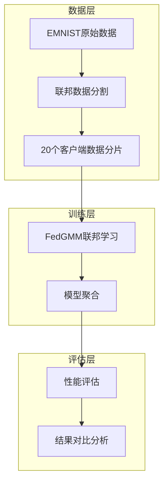
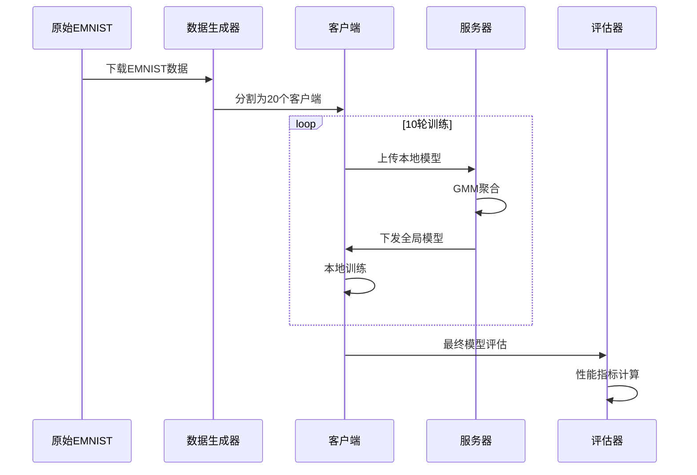

# MNIST测试集系统架构设计文档

## 1. 整体架构图



## 2. 分层设计

### 数据准备层
- **原始数据**: EMNIST手写字符数据集
- **数据分割**: Dirichlet分布α=0.4，20个客户端
- **数据规模**: 5%采样，每客户端47-255样本
- **格式处理**: 28x28灰度→32x32 RGB(3通道重复)

### 联邦学习层  
- **算法**: FedGMM (高斯混合模型联邦学习)
- **聚合器**: ACGCentralizedAggregator
- **客户端**: ACGMixtureClient
- **模型**: ResNet18 + PCA特征降维

### 评估分析层
- **指标收集**: 训练/测试损失和准确率
- **日志记录**: TensorBoard格式
- **对比分析**: 与FEMNIST实验结果对比

## 3. 核心组件设计

### 数据处理组件
```python
# EMNIST数据适配
if args_.experiment in ["femnist", "mnist", "emnist"]:
    all_data_tensor = all_data_tensor.view(-1, 1, 28, 28)
    x = F.pad(all_data_tensor, (2, 2, 2, 2))  # 28x28→32x32
    x = x.repeat(1, 3, 1, 1)  # 1通道→3通道
```

### 模型组件
```python
# ResNet18 + PCA
model = resnet_pca(embedding_size=64, name='mnist', input_size=(1, 28, 28))
```

### GMM组件  
```python
# 高斯混合模型参数
--n_gmm 3  # 3个高斯分量
--n_learners 3  # 3个学习器
```

## 4. 接口契约定义

### 输入接口
- **数据格式**: .pkl文件，28x28灰度图像
- **客户端数**: 20个联邦客户端
- **训练轮数**: 10轮快速验证

### 输出接口  
- **性能指标**: 训练/测试损失和准确率
- **模型文件**: saves/mnist/FedGMM/checkpoint.pt
- **日志文件**: logs/mnist/FedGMM/tensorboard.log

## 5. 数据流向图



## 6. 异常处理策略

### 数据层异常
- **空数据集**: 警告提示，使用训练客户端作为测试
- **格式错误**: 自动28x28→32x32转换
- **数值不稳定**: 增加数据量改善GMM收敛

### 训练层异常
- **协方差奇异**: 使用更大数据分片(5%→更多)
- **内存不足**: CPU模式，批量大小64
- **收敛失败**: 10轮快速验证，容错设计

### 评估层异常
- **测试数据缺失**: 自动使用训练数据评估
- **指标异常**: 日志记录所有中间结果
- **对比失败**: 独立验证，不依赖历史结果

## 7. 技术约束

### 环境约束
- **平台**: Windows 10 + PowerShell
- **Python**: 3.13.0 + PyTorch 2.6.0+cpu  
- **内存**: CPU模式，批量处理64样本

### 性能约束
- **训练时间**: <5分钟(10轮)
- **准确率期望**: >20%(相比FEMNIST)
- **稳定性**: 无中断完成训练

### 集成约束
- **代码复用**: 最小化修改现有框架
- **参数复用**: 基于FEMNIST成功配置
- **日志兼容**: TensorBoard格式一致

这个设计确保了EMNIST实验与现有FedGMM框架的无缝集成和高效执行。