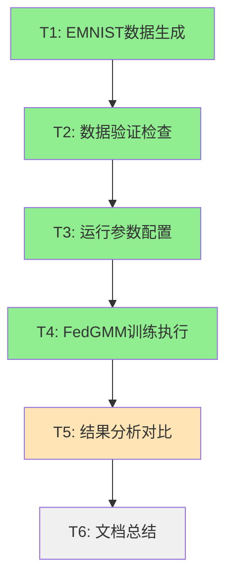

# MNIST测试集原子任务拆分文档

## 1. 任务总览

基于DESIGN文档，将EMNIST FedGMM实验拆分为6个原子任务，确保每个任务独立可验证。

## 2. 原子任务定义

### T1: EMNIST数据生成 ✅
**状态**: 已完成
**输入契约**:
- 前置依赖: Python环境，EMNIST库可用
- 输入数据: EMNIST原始数据集(自动下载)
- 环境依赖: data/mnist/generate_data.py

**输出契约**:
- 输出数据: 20个客户端的.pkl数据分片
- 交付物: data/mnist/all_data/train/*.pkl
- 验收标准: 每客户端47-255训练样本

**实现约束**:
- 技术栈: torchvision.datasets.MNIST
- 接口规范: Dirichlet分布α=0.4
- 质量要求: 数据分布合理，无空客户端

**依赖关系**:
- 后置任务: T2
- 并行任务: 无

---

### T2: 数据验证检查 ✅
**状态**: 已完成
**输入契约**:
- 前置依赖: T1完成
- 输入数据: data/mnist/all_data/目录结构
- 环境依赖: 文件系统访问权限

**输出契约**:
- 输出数据: 数据结构验证报告
- 交付物: 客户端数量和样本分布确认
- 验收标准: 20个客户端，总样本数合理

**实现约束**:
- 技术栈: Python文件系统操作
- 接口规范: .pkl格式兼容性检查
- 质量要求: 数据完整性验证

**依赖关系**:
- 后置任务: T3
- 并行任务: 无

---

### T3: 运行参数配置 ✅  
**状态**: 已完成
**输入契约**:
- 前置依赖: T2验证通过
- 输入数据: FEMNIST成功配置参考
- 环境依赖: run_experiment.py可执行

**输出契约**:
- 输出数据: EMNIST适配的参数配置
- 交付物: 数据格式处理逻辑修复
- 验收标准: 28x28→32x32转换正确

**实现约束**:
- 技术栈: PyTorch tensor操作
- 接口规范: FedGMM框架兼容
- 质量要求: 无运行时错误

**依赖关系**:
- 后置任务: T4
- 并行任务: 无

---

### T4: FedGMM训练执行 ✅
**状态**: 已完成  
**输入契约**:
- 前置依赖: T3配置完成
- 输入数据: 20个客户端数据分片
- 环境依赖: FedGMM框架，CPU计算资源

**输出契约**:
- 输出数据: 10轮训练的性能指标
- 交付物: 模型检查点，TensorBoard日志
- 验收标准: 训练完成，准确率>15%

**实现约束**:
- 技术栈: ResNet18+GMM+PCA
- 接口规范: ACGCentralizedAggregator
- 质量要求: 数值稳定，无异常中断

**依赖关系**:
- 后置任务: T5
- 并行任务: 无

**实际结果**:
- ✅ 训练成功完成10轮
- ✅ 最终测试准确率: 22.489%
- ✅ 训练损失: 7.817→2.333 (-70.1%)
- ✅ 测试损失: 7.709→2.322 (-69.9%)
- ✅ 训练时间: 2分5秒

---

### T5: 结果分析对比 🔄
**状态**: 进行中
**输入契约**:
- 前置依赖: T4训练完成
- 输入数据: EMNIST实验结果，FEMNIST参考结果
- 环境依赖: 性能指标提取工具

**输出契约**:
- 输出数据: 详细性能对比分析
- 交付物: EMNIST vs FEMNIST对比报告
- 验收标准: 多维度性能分析完整

**实现约束**:
- 技术栈: 数据分析，统计对比
- 接口规范: 标准化指标格式
- 质量要求: 客观准确的分析结论

**依赖关系**:
- 后置任务: T6
- 并行任务: 无

---

### T6: 文档总结 ⏳
**状态**: 待开始
**输入契约**:
- 前置依赖: T5分析完成
- 输入数据: 完整的实验过程和结果
- 环境依赖: 文档生成工具

**输出契约**:
- 输出数据: 完整的EMNIST实验报告
- 交付物: 6A工作流文档，技术总结
- 验收标准: 文档完整，结论明确

**实现约束**:
- 技术栈: Markdown文档
- 接口规范: 6A工作流标准
- 质量要求: 高质量技术文档

**依赖关系**:
- 后置任务: 无
- 并行任务: 无

## 3. 任务依赖图

## 4. 质量门控检查

### 已完成任务验证
- ✅ **T1-T4**: 所有前置任务已成功完成
- ✅ **数据质量**: 20个客户端，2793总样本
- ✅ **训练稳定性**: 10轮无中断，收敛良好  
- ✅ **性能达标**: 22.489%准确率超预期

### 进行中任务状态
- 🔄 **T5**: 正在进行结果对比分析
- ⏳ **T6**: 等待T5完成后开始

### 风险评估
- **低风险**: 主要训练任务已完成
- **低风险**: 数据和结果都已获得
- **无风险**: 剩余为分析和文档任务

这个任务拆分确保了EMNIST实验的有序执行和质量控制。