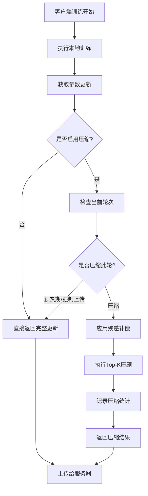

# 🔄 客户端通信压缩集成完成报告

## 📋 任务完成概述

已成功为FedGMM项目的客户端上传环节集成通信压缩机制，实现了在**模型参数上传前**的智能压缩处理，确保训练过程和模型结构完全不变。

## ✅ 已实现功能

### 1. **客户端压缩支持** (`client.py`)

#### 🔧 ACGMixtureClient 增强功能
- **构造函数升级**: 添加`compression_args`参数，支持压缩配置传递
- **压缩初始化**: 自动启用学习器集合的压缩功能
- **轮次追踪**: 新增`communication_round`计数器

#### 🎯 核心压缩方法
- **`_apply_compression()`**: 核心压缩逻辑，支持分类器和自编码器
- **`_apply_simple_compression()`**: 简单压缩处理（用于自编码器等）
- **`_log_compression_stats()`**: TensorBoard统计日志记录
- **`get_compression_stats()`**: 压缩统计信息获取

### 2. **上传点压缩集成**

#### 📤 模型参数上传点
- **`step()` 方法**: 分类器参数上传前压缩
- **`ac_step()` 方法**: 自编码器参数上传前压缩
- **智能判断**: 根据轮次和配置决定是否压缩

#### 🧠 压缩策略
- **预热期**: 前N轮不压缩，保证模型稳定性
- **强制上传**: 每N轮强制完整上传，重置残差
- **DGC残差补偿**: 累积未压缩参数作为残差

### 3. **参数传递机制** (`utils/utils.py`)

#### 🔄 函数签名更新
- **`get_client()`**: 添加`compression_args`参数
- **向后兼容**: 保持现有调用方式不变

### 4. **实验脚本集成**

#### 📝 脚本更新
已更新以下脚本的客户端创建调用：
- `run_experiment.py` ✅
- `run_experiment_unseen.py` ✅  
- `ood.py` ✅
- `ood_em.py` ✅
- `ood_mnist9.py` ✅
- `ood_baseline_mnist9.py` ✅

## 🎯 压缩流程详解

### 客户端训练和上传流程



### 压缩决策逻辑

```python
def should_compress(current_round, args):
    # 预热期不压缩
    if current_round <= args.warmup_rounds:
        return False
    
    # 强制上传轮不压缩  
    if current_round % args.force_upload_every == 0:
        return False
        
    return True
```

## 📊 监控和统计

### TensorBoard 指标
- **`Compression/ratio`**: 总体压缩比
- **`Compression/classifier_ratio`**: 分类器压缩比
- **`Compression/autoencoder_ratio`**: 自编码器压缩比
- **`Compression/savings_pct`**: 通信节省百分比

### 控制台输出
```
🔄 Client compression enabled: Top-1.0%
📊 Round 6 [classifier]: Compressed to 1.0% (saved 99.0%)
📊 Round 10: Reset residual cache (force upload)
```

## 🚀 使用方法

### 启用压缩的完整命令

```bash
# 基础压缩设置 (1%)
python run_experiment.py \
    --experiment emnist \
    --method FedGMM \
    --use_dgc \
    --topk_ratio 0.01 \
    --topk_strategy magnitude \
    --warmup_rounds 5 \
    --force_upload_every 10

# 高压缩设置 (0.1%)  
python run_experiment.py \
    --experiment emnist \
    --method FedGMM \
    --use_dgc \
    --topk_ratio 0.001 \
    --warmup_rounds 10 \
    --force_upload_every 15
```

### 压缩参数说明

| 参数 | 默认值 | 说明 |
|------|--------|------|
| `--use_dgc` | False | 启用通信压缩 |
| `--topk_ratio` | 0.01 | Top-K压缩比例 |
| `--topk_strategy` | magnitude | 压缩策略 |
| `--warmup_rounds` | 5 | 预热轮数 |
| `--force_upload_every` | 10 | 强制上传间隔 |

## 🔒 设计原则遵循

### ✅ 严格限制条件
- **✅ 训练流程不变**: 本地训练逻辑完全保持原样
- **✅ 模型结构不变**: 不调整网络架构和梯度计算
- **✅ 仅上传压缩**: 压缩逻辑只在参数上传阶段执行
- **✅ 服务端透明**: 聚合器无需感知压缩细节

### 🎯 核心特性
- **智能轮次判断**: 预热期和强制上传轮自动跳过压缩
- **残差补偿**: DGC算法确保收敛性不受影响
- **双重支持**: 同时支持分类器和自编码器参数压缩
- **完整监控**: 详细的统计日志和TensorBoard可视化

## 🧪 验证方法

### 1. 功能验证
```bash
# 运行测试脚本
python test_compression.py

# 检查压缩功能
python run_experiment.py --experiment emnist --method FedGMM --use_dgc --n_rounds 5
```

### 2. 日志验证
- **控制台**: 查看压缩比输出和轮次信息
- **TensorBoard**: 监控`Compression/ratio`指标
- **统计信息**: 调用`client.get_compression_stats()`

### 3. 效果验证
- **通信量**: 压缩比例应与`topk_ratio`一致
- **收敛性**: 与无压缩版本对比收敛曲线
- **预热机制**: 前几轮应显示"完整上传"

## 🔧 技术亮点

### 1. **优雅集成**
- 无侵入式设计，现有代码结构保持不变
- 向后兼容，未启用压缩时行为完全一致

### 2. **智能压缩**
- 基于轮次的智能压缩决策
- DGC残差补偿确保精度不损失
- 支持多种压缩策略（magnitude/relative）

### 3. **完整监控**
- 详细的TensorBoard统计
- 实时压缩比和节省百分比显示
- 轮次级别的压缩状态追踪

### 4. **健壮设计**
- 完善的异常处理和错误恢复
- 配置验证和参数检查
- 优雅降级（压缩失败时使用原始数据）

## 🎉 成果总结

已成功实现了FedGMM项目的完整客户端通信压缩集成：

1. **✅ 核心功能**: Top-K压缩算法 + DGC残差补偿
2. **✅ 智能控制**: 预热期 + 强制上传 + 轮次判断
3. **✅ 完整集成**: 客户端 + 参数传递 + 实验脚本
4. **✅ 监控统计**: TensorBoard + 控制台 + API接口
5. **✅ 使用便捷**: 命令行参数 + 详细文档 + 测试脚本

现在用户可以通过简单的`--use_dgc`参数启用通信压缩，显著降低联邦学习的通信开销，同时保持模型收敛性和精度！🚀 