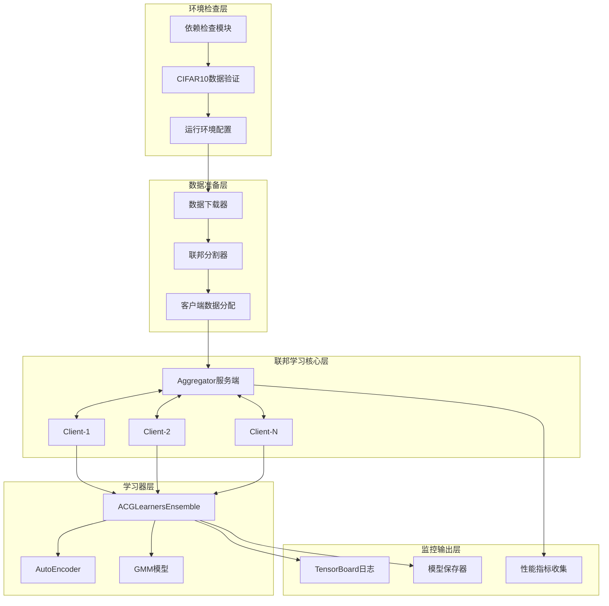
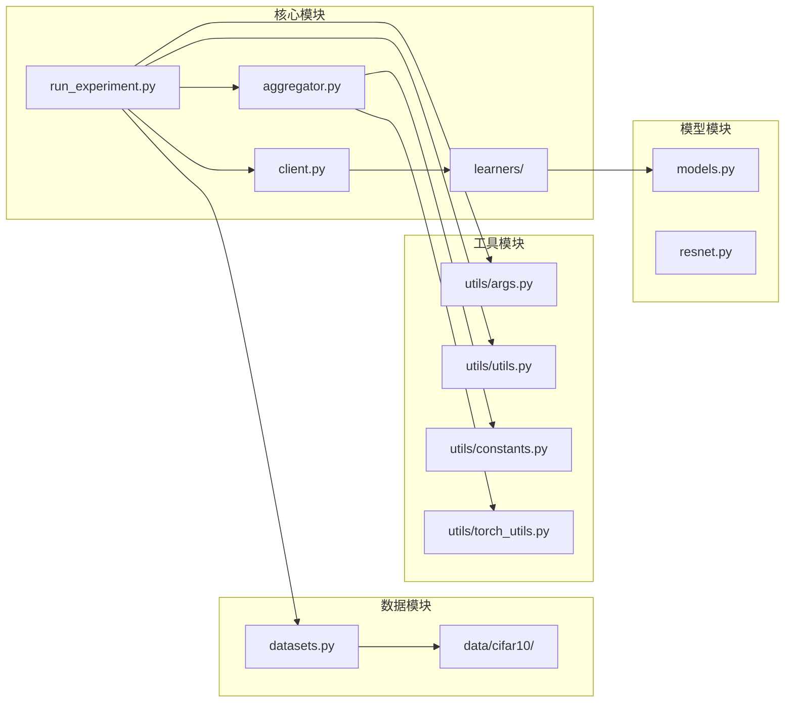
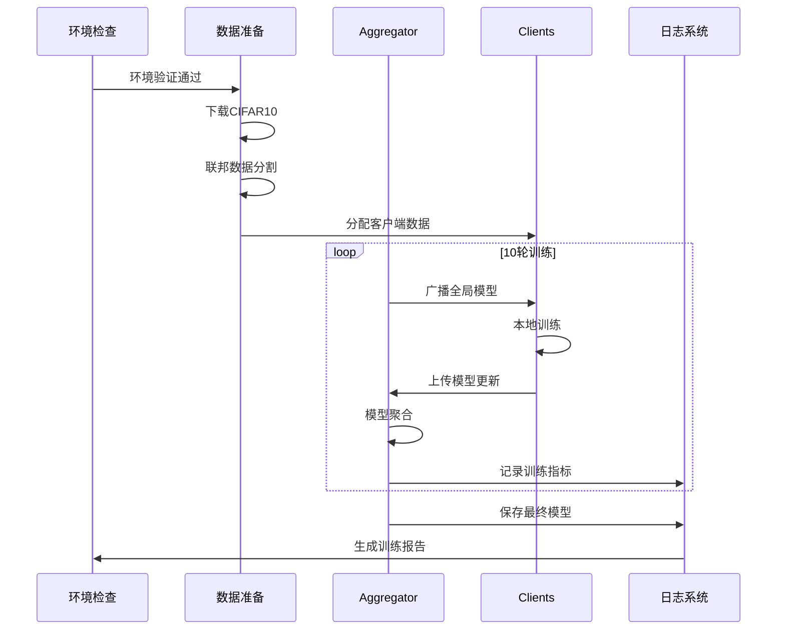

# FedGMM快速验证运行架构设计文档

## 1. 整体架构图



## 2. 分层设计和核心组件

### 2.1 环境检查层
**职责**: 确保运行环境就绪

**核心组件**:
- **依赖检查模块**: 验证requirements.txt中的包
- **数据验证模块**: 检查CIFAR10数据完整性  
- **配置模块**: 设置日志路径、设备类型等

### 2.2 数据准备层
**职责**: 准备联邦学习数据

**核心组件**:
- **数据下载器**: 自动下载CIFAR10数据集
- **联邦分割器**: 按Dirichlet分布分割数据
- **数据加载器**: 创建训练/测试迭代器

### 2.3 联邦学习核心层
**职责**: 执行联邦训练流程

**核心组件**:
- **ACGCentralizedAggregator**: 服务端协调器
- **ACGMixtureClient**: 客户端训练器
- **通信协议**: 模型参数同步机制

### 2.4 学习器层
**职责**: 本地模型训练和推理

**核心组件**:
- **ACGLearnersEnsemble**: 学习器集合管理
- **AutoEncoder**: 特征编码器
- **GMM**: 高斯混合模型

### 2.5 监控输出层
**职责**: 训练过程监控和结果保存

**核心组件**:
- **日志收集器**: TensorBoard格式日志
- **模型保存器**: 定期保存检查点
- **指标计算器**: 准确率、损失等指标

## 3. 模块依赖关系图



## 4. 接口契约定义

### 4.1 主程序接口
```python
# run_experiment.py 主入口
def run_experiment(args) -> None:
    """
    输入: 命令行参数配置
    输出: 训练完成状态
    异常: ConfigError, DataError, TrainingError
    """
```

### 4.2 数据层接口
```python
# 数据加载接口
def get_loaders(type_, root_path, batch_size, **kwargs) -> Tuple[List, List, List]:
    """
    输入: 数据集类型、路径、批次大小
    输出: (训练迭代器列表, 验证迭代器列表, 测试迭代器列表)
    """

# 客户端初始化接口  
def init_clients(args, root_path, logs_dir, save_path) -> List[Client]:
    """
    输入: 配置参数、数据路径、日志路径、保存路径
    输出: 客户端列表
    """
```

### 4.3 聚合器接口
```python
class ACGCentralizedAggregator:
    def mix(self) -> None:
        """执行一轮联邦聚合"""
        
    def update_clients(self) -> None:
        """更新客户端模型"""
        
    def write_logs(self) -> None:
        """写入训练日志"""
```

### 4.4 客户端接口
```python
class ACGMixtureClient:
    def step(self, single_batch_flag=False) -> Dict:
        """
        执行本地训练步骤
        输出: {"loss": float, "accuracy": float}
        """
```

## 5. 数据流向图



## 6. 异常处理策略

### 6.1 环境异常处理
```python
try:
    # 依赖检查
    import torch, torchvision, numpy, sklearn
except ImportError as e:
    raise EnvironmentError(f"缺少依赖包: {e}")
```

### 6.2 数据异常处理
```python
if not os.path.exists("data/cifar10/all_data"):
    print("正在下载CIFAR10数据集...")
    download_and_prepare_cifar10()
```

### 6.3 训练异常处理
```python
try:
    aggregator.mix()
except RuntimeError as e:
    logger.error(f"训练轮次{current_round}失败: {e}")
    save_checkpoint(current_round)
    raise TrainingError(f"训练中断于第{current_round}轮")
```

### 6.4 资源异常处理
```python
if torch.cuda.is_available() and args.device == "cuda":
    device = "cuda"
else:
    device = "cpu"
    logger.warning("使用CPU训练，速度可能较慢")
```

## 7. 设计原则验证

### 7.1 任务范围对齐
✅ **严格按照任务范围**: 仅实现快速验证，避免过度设计  
✅ **10轮训练限制**: 通过--n_rounds 10参数控制  
✅ **CIFAR10专用**: 针对cifar10数据集优化流程  

### 7.2 现有系统一致性
✅ **复用现有架构**: 基于ACGCentralizedAggregator + ACGMixtureClient  
✅ **保持接口兼容**: 使用现有的run_experiment.py入口  
✅ **日志格式一致**: 使用项目现有的TensorBoard日志格式  

### 7.3 组件复用性
✅ **工具函数复用**: 使用utils/模块现有函数  
✅ **配置常量复用**: 使用utils/constants.py配置  
✅ **模型组件复用**: 使用learners/现有学习器实现  

## 8. 可行性验证

### 8.1 技术可行性
- **PyTorch兼容性**: ✅ 版本2.6.0支持所需功能
- **内存需求**: ✅ CIFAR10 + 小批次(64)可在8GB内运行  
- **计算复杂度**: ✅ 10轮训练预计5-15分钟完成

### 8.2 数据可行性  
- **CIFAR10可用性**: ✅ 可自动下载，32x32小图像
- **联邦分割**: ✅ 现有Dirichlet分布分割算法
- **存储需求**: ✅ ~200MB数据集大小

### 8.3 集成可行性
- **现有代码兼容**: ✅ 基于现有run_experiment.py框架
- **依赖版本兼容**: ✅ requirements.txt已验证组合
- **输出格式兼容**: ✅ TensorBoard + pt模型格式