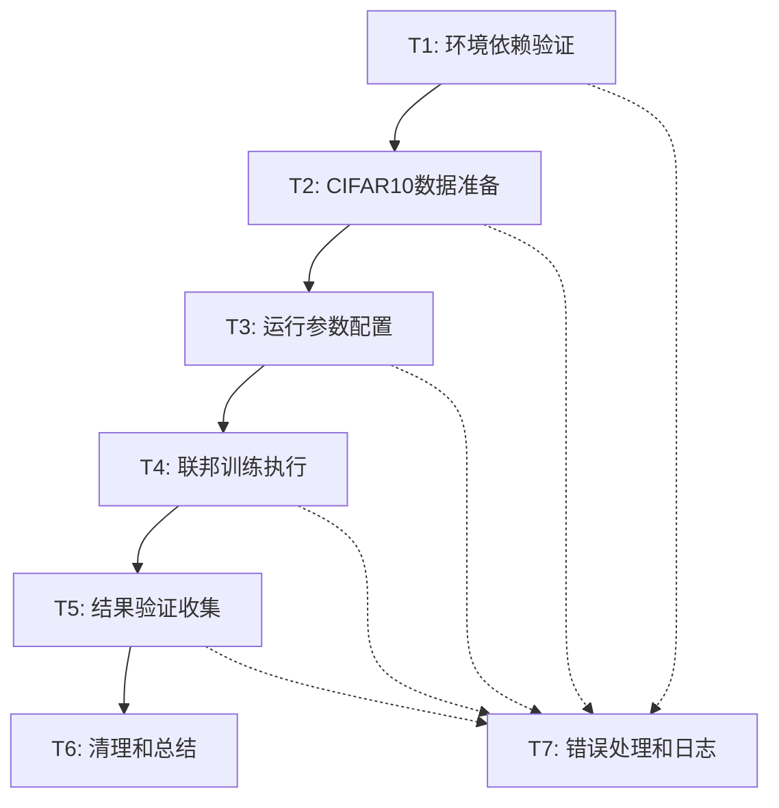

# FedGMM快速验证运行原子任务拆分文档

## 1. 任务依赖关系图

## 2. 原子任务详细规范

### T1: 环境依赖验证
**任务描述**: 验证Python环境和所有依赖包正确安装

**输入契约**:
- 前置依赖: Python 3.x环境，pip可用
- 输入数据: requirements.txt文件
- 环境依赖: FedGMM项目根目录

**输出契约**:
- 输出数据: 依赖验证报告(dict格式)
- 交付物: 环境状态确认
- 验收标准: 所有依赖包import成功，版本兼容

**实现约束**:
- 技术栈: Python import + pip list验证
- 接口规范: 返回布尔值 + 错误详情
- 质量要求: 详细错误信息，失败时提供安装建议

**依赖关系**:
- 后置任务: T2(数据准备)
- 并行任务: 无
- 阻塞条件: Python环境不可用

---

### T2: CIFAR10数据准备
**任务描述**: 检查并准备CIFAR10联邦学习数据集

**输入契约**:
- 前置依赖: T1环境验证通过
- 输入数据: data/cifar10/目录状态
- 环境依赖: PyTorch, torchvision可用

**输出契约**:
- 输出数据: 联邦分割的CIFAR10数据集
- 交付物: data/cifar10/all_data/目录结构
- 验收标准: 数据集完整，分割文件存在，格式正确

**实现约束**:
- 技术栈: torchvision.datasets + 自定义分割算法
- 接口规范: 生成.pkl格式的客户端数据文件
- 质量要求: 数据完整性校验，分割均匀性检查

**依赖关系**:
- 前置任务: T1(环境验证)
- 后置任务: T3(参数配置)
- 并行任务: 无

---

### T3: 运行参数配置
**任务描述**: 配置快速验证运行的所有参数

**输入契约**:
- 前置依赖: T2数据准备完成
- 输入数据: 默认参数配置
- 环境依赖: utils/args.py可用

**输出契约**:
- 输出数据: 验证过的参数配置对象
- 交付物: 完整的args配置
- 验收标准: 参数合法性验证通过，设备可用性确认

**实现约束**:
- 技术栈: argparse + 自定义验证逻辑
- 接口规范: 标准的命令行参数格式
- 质量要求: 参数范围检查，设备兼容性验证

**依赖关系**:
- 前置任务: T2(数据准备)
- 后置任务: T4(训练执行)
- 并行任务: T7(日志系统初始化)

---

### T4: 联邦训练执行
**任务描述**: 执行10轮FedGMM联邦学习训练

**输入契约**:
- 前置依赖: T3参数配置完成
- 输入数据: 客户端数据 + 模型参数
- 环境依赖: 完整的FedGMM框架

**输出契约**:
- 输出数据: 训练过程指标(loss, accuracy)
- 交付物: 训练完成的模型 + TensorBoard日志
- 验收标准: 10轮训练无中断，指标正常收敛

**实现约束**:
- 技术栈: PyTorch + FedGMM核心算法
- 接口规范: run_experiment.py标准接口
- 质量要求: 异常处理完善，训练进度可监控

**依赖关系**:
- 前置任务: T3(参数配置)
- 后置任务: T5(结果验证)
- 并行任务: T7(日志记录)

---

### T5: 结果验证收集
**任务描述**: 验证训练结果并收集关键指标

**输入契约**:
- 前置依赖: T4训练执行完成
- 输入数据: 训练日志 + 保存的模型
- 环境依赖: TensorBoard + 分析工具

**输出契约**:
- 输出数据: 验证报告(准确率、收敛性等)
- 交付物: 结果汇总文档
- 验收标准: 模型收敛验证，准确率超过基线

**实现约束**:
- 技术栈: TensorBoard读取 + NumPy分析
- 接口规范: 标准化的指标输出格式
- 质量要求: 指标计算准确，结果解释清晰

**依赖关系**:
- 前置任务: T4(训练执行)
- 后置任务: T6(清理总结)
- 并行任务: 无

---

### T6: 清理和总结
**任务描述**: 清理临时文件并生成最终总结报告

**输入契约**:
- 前置依赖: T5结果验证完成
- 输入数据: 所有训练产物
- 环境依赖: 文件系统访问权限

**输出契约**:
- 输出数据: 清理后的工作空间
- 交付物: 最终总结报告
- 验收标准: 重要文件保留，临时文件清理，报告完整

**实现约束**:
- 技术栈: 标准文件操作 + Markdown报告
- 接口规范: 结构化的报告模板
- 质量要求: 信息完整性，可读性好

**依赖关系**:
- 前置任务: T5(结果验证)
- 后置任务: 无
- 并行任务: 无

---

### T7: 错误处理和日志 (辅助任务)
**任务描述**: 提供全流程的错误处理和日志记录

**输入契约**:
- 前置依赖: 各主任务执行
- 输入数据: 错误信息 + 运行状态
- 环境依赖: Python logging模块

**输出契约**:
- 输出数据: 结构化日志文件
- 交付物: 错误处理报告
- 验收标准: 异常捕获完整，日志信息充分

**实现约束**:
- 技术栈: Python logging + 自定义处理器
- 接口规范: 标准日志级别和格式
- 质量要求: 错误信息准确，恢复策略清晰

**依赖关系**:
- 前置任务: 与所有主任务并行
- 后置任务: 无
- 并行任务: T1-T6全部任务

## 3. 任务复杂度评估

| 任务ID | 复杂度 | 预估时间 | 风险等级 | 备注 |
|--------|---------|----------|----------|------|
| T1     | 低      | 5分钟    | 低       | 标准环境检查 |
| T2     | 中      | 10分钟   | 中       | 数据下载可能较慢 |
| T3     | 低      | 3分钟    | 低       | 配置验证 |
| T4     | 高      | 15分钟   | 中       | 核心训练逻辑 |
| T5     | 中      | 5分钟    | 低       | 结果分析 |
| T6     | 低      | 2分钟    | 低       | 清理总结 |
| T7     | 中      | 贯穿全程 | 低       | 日志和异常处理 |

**总计预估时间**: 40分钟 (包含缓冲时间)
**关键路径**: T1→T2→T3→T4→T5→T6 (约35分钟)

## 4. 质量保证策略

### 单元测试策略
- T1: 依赖版本兼容性测试
- T2: 数据完整性和格式验证  
- T4: 训练步骤正确性验证
- T5: 指标计算准确性验证

### 集成测试策略
- 端到端流程测试
- 异常情况恢复测试
- 资源使用限制测试

### 验收测试策略
- 功能完整性验证
- 性能指标达标验证  
- 输出格式规范验证